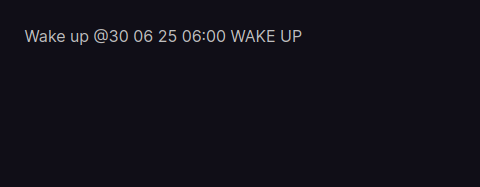
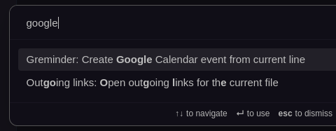
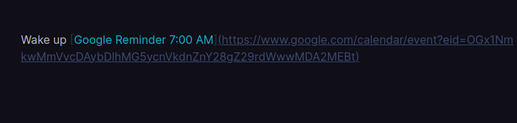
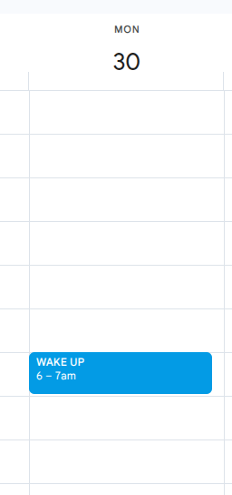

# Greminder

Greminder is an Obsidian plugin that allows you to quickly create Google Calendar reminders directly from your notes using a simple inline annotation.

## Features

- **Inline Annotation**: Create events by typing `@ dd mm yy hh:mm` followed by the event title.
- **Automatic Event Creation**: Greminder automatically parses the annotation and creates a Google Calendar event.
- **Custom Reminders**: A default 10-minute reminder is set for each event.
- **Confirmation Link**: After creating the event, the annotation is replaced with a link to the Google Calendar event.

## Installation

1.  **Download the Plugin**: Download the latest release from the [releases page](https://github.com/your-username/greminder/releases).
2.  **Install in Obsidian**:
    -   Open Obsidian's settings.
    -   Go to **Community plugins** and make sure **Restricted mode** is off.
    -   Go to the **Installed plugins** tab and click the folder icon to open the plugins folder.
    -   Unzip the downloaded release and copy the `greminder` folder into your Obsidian plugins folder.
    -   Go back to the **Installed plugins** tab in Obsidian and click the refresh button.
    -   Enable the "Greminder" plugin.

## Configuration

To use Greminder, you need to provide your own Google Calendar API credentials. This is a one-time setup.

### Obtaining Google API Credentials

1.  **Go to the Google Cloud Console**: Navigate to the [Google Cloud Console](https://console.cloud.google.com/).
2.  **Create a New Project**: Create a new project or select an existing one.
3.  **Enable the Google Calendar API**:
    -   Go to the **API & Services > Library** page.
    -   Search for "Google Calendar API" and enable it.
4.  **Create OAuth 2.0 Credentials**:
    -   Go to the **API & Services > Credentials** page.
    -   Click **Create Credentials** and select **OAuth client ID**.
    -   Choose **Desktop app** as the application type.
    -   Give it a name (e.g., "Obsidian Greminder") and click **Create**.
    -   A dialog will appear with your **Client ID** and **Client Secret**. Copy these down.
5.  **Get a Refresh Token**:
    -   This is the most complex step. You'll need to use the OAuth 2.0 Playground or a script to get a refresh token. You can find many tutorials online by searching for "how to get a google api refresh token".

### Plugin Settings

1.  Open Obsidian's settings.
2.  Go to the **Greminder** plugin settings.
3.  Enter your **Client ID**, **Client Secret**, and **Refresh Token** into the respective fields.

## How to Use

Once the plugin is configured, you can create a reminder from any line in a note.

1.  Write your reminder text in the format `@ dd mm yy hh:mm Your reminder text`. Make sure your cursor is on that line.
    
    `@ 29 06 25 15:30 Team Meeting`

2.  Trigger the event creation using one of the following methods:
    -   **Ribbon Icon**: Click the calendar icon in the far-left sidebar.
    -   **Command Palette**: Press `Ctrl/Cmd + P`, type `Greminder`, and select "Create Google Calendar event from current line".

3.  Greminder will then:
    -   Parse the date, time, and summary.
    -   Create a new event in your primary Google Calendar.
    -   Set a 10-minute reminder.
    -   Replace the line with a formatted link to the newly created event.

## Screenshots

1.  **Write your reminder in the correct format.**
    

2.  **Use the command palette (`Ctrl/Cmd + P`) to trigger the event.**
    

3.  **The text is replaced with a confirmation link.**
    

4.  **The final rendered link in your note.**
    

5.  **The event appears in your Google Calendar.**

    

## Contributing

Contributions are welcome! If you'd like to improve Greminder, please feel free to fork the repository and submit a pull request.

## License

This plugin is licensed under the [MIT License](LICENSE).
